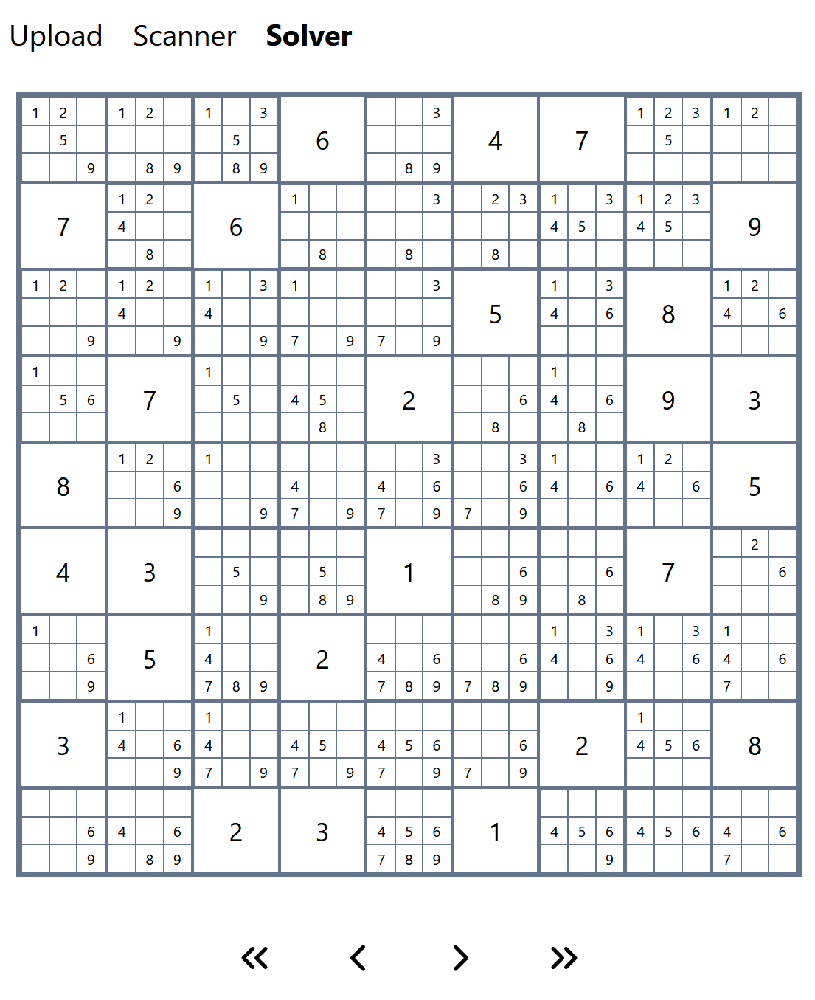

# Picture-Solver

This is a next.js app that uses image recognition to parse and detect a Sudoku from a picture. Additionally it allows the user to step through the sudoku step by step to get additional hints of which number could have been found next.

## Image recognition

THe image recognition is done by using openCV for processing and trying to find a grid in a picture that resembles a Sudoku. Afterwards the sudoku is transposed and cut into 81 parts that are sent through the MNIST model for recognicing handwritten integers. All of this is purely done in the browser by using tensorflow JS and an openCV WebAssembly port.

## Sudoku Solving

Currently the solving capabilities are quite limited and only work for "simple" cases. This could be improved in the future.

